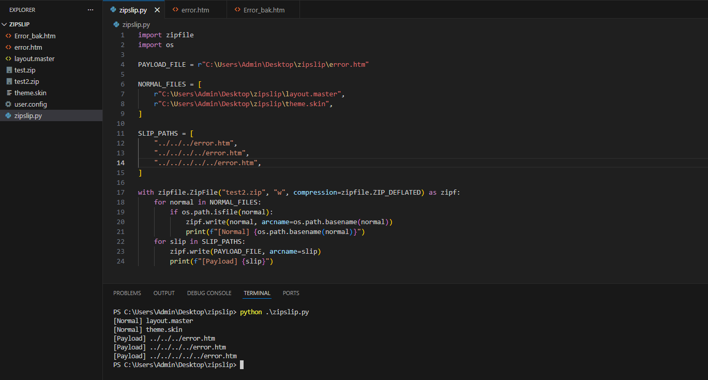
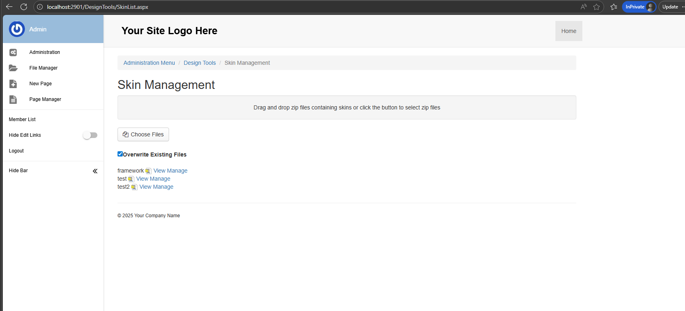
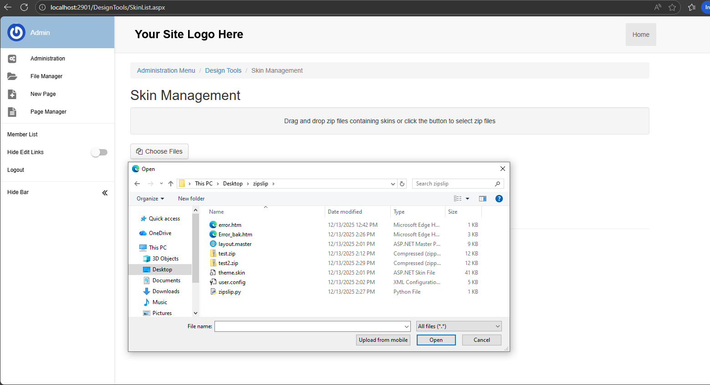
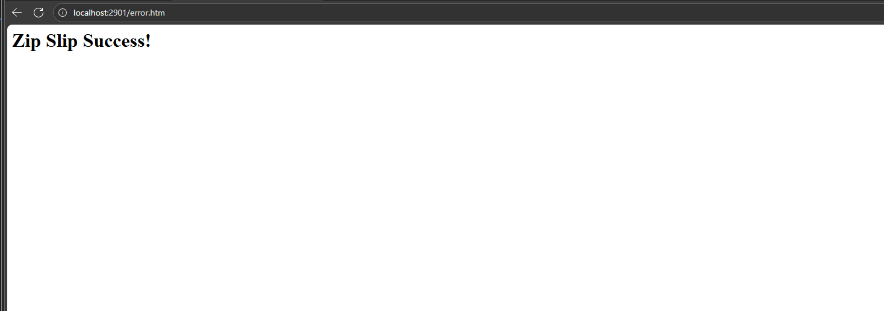

# Zipslip in MojoPortal version 2.9.0.1
## Vulnerability Description
The application extracts archive entries without properly validating or sanitizing the file paths contained within the archive. When the application extracts the archive, these malicious paths allow files to be written outside of the intended destination directory. 

## Root Cause
CWE-22: Improper Limitation of a Pathname to a Restricted Directory ('Path Traversal')
- Lack of validate, sanitize entry in archive
- Use vulnerable zip library 
## Recommendations
- Normalize and validate the canonical path of each extracted file
- Ensure the final resolved path starts with the intended destination directory
- Reject archive entries containing path traversal sequences or absolute paths
- Use secure, well-maintained libraries that implement path validation by default
## Proof of Concept

**Step 1: Craft a malicious archive**
Use python script to build a archive 

- Require valid layout.master, theme.skin file
- error.htm is payload file we want overwrited. 

**Step 1: Access endpoint /DesignTools/SkinList.aspx**

Require admin

**Step 3: Upload zip file**

Result 

We can overwrite existed file, upload new file but limit extension in whitelist

## Fix
I found information at https://www.mojoportal.com/mojoportal-2-9-1 stating that some bugs related to zip files have been fixed. This may be why I cannot confirm the bug on the higher version.

## Demo video 

http://youtube.com/watch?v=4ElmiV-y61s
